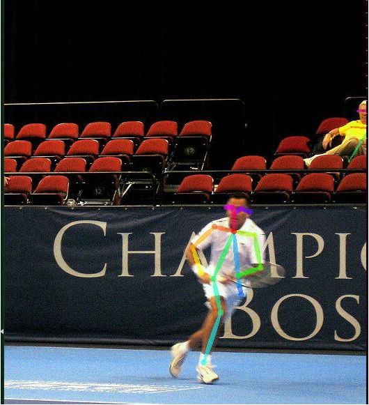
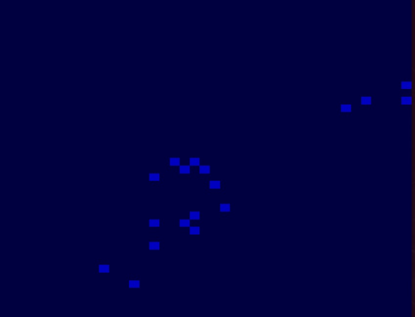
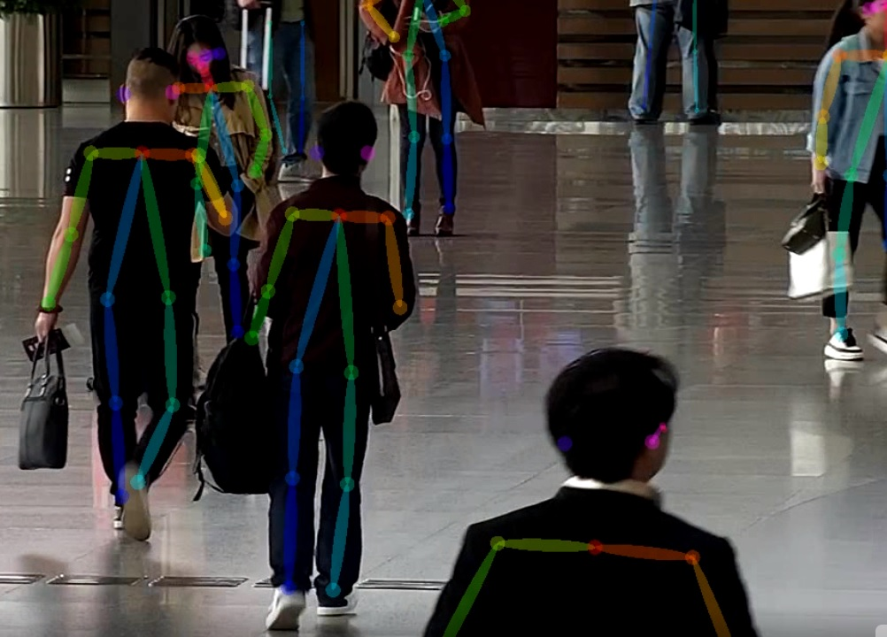

# deepstream-openpose


## 1.  Run [CMU](https://github.com/CMU-Perceptual-Computing-Lab/openpose) pose demo
Platform: xavier, Jetpack 4.3 with DeepStream 4.0.2

 Notes:
 1. Porting to Tesla/x86 platform should be easy.
 2. CUDA_cublas_device_LIBRARY NOTFOUND issue ->
   [Solution](https://forums.developer.nvidia.com/t/cuda-blas-libraries-not-installed/107908/18?u=chrisding)
 3. Refer to `openpose/scripts/ubuntu/install_deps.sh` to install deps libs.
 4. Refer to `openpose/models/getModels.sh` to fetch models
 5. Build.
     ```
     $ cmake -D CMAKE_BUILD_TYPE=Debug ..
     $ make -j4
     ```
 6. These demos can work.
     ```
     $ ./build/examples/openpose/openpose.bin
     $ ./build/examples/tutorial_api_cpp/01_body_from_image_default.bin
     $ ...
     ```
   It show like this.

<p align="center">
    
</p>

## 2.  Deploy pose coco model by DeepStream 4.0.2
 Model: `pose/coco/pose_iter_440000.caffemodel`,  `pose/coco/pose_deploy_linevec.prototxt`

 Pipeline:
 > filesrc -> jpegparse -> nvv4l2decoder -> nvstreammux -> nvinfer (openpose and 18 parts parse)
nvsegvidsual -> nvmultistreamtiler -> (nvegltransform) -> nveglglessink

### Build libnvds_infer.so
  ```
  $ cd libs/nvinfer
  $ make
  Backup /opt/nvidia/deepstream/deepstream-4.0/lib/libnvds_infer.so
  $ sudo ln -sf $(pwd)/libnvds_infer.so /opt/nvidia/deepstream/deepstream-4.0/lib/libnvds_infer.so 
  ```

### Build openpose-app
  ```
  $ cd openpose_app
  $ make
  Change nvinfer_config.txt "model-file" and "proto-file" to be your path
   model-file=
   proto-file=
  ```

### Run
  ```
  $ ./openpose-app ./nvinfer_config.txt COCO_val2014_000000000564.jpg
  ```
<p align="center">
    
</p>

## 3.  TODO
Add dsexample plugin after nvinfer and do [resize_merge](./libs/nvdsinfer/resize_merge_cpu.cpp), [nms](./libs/nvdsinfer/nms_cpu.cpp) and BodyPartConnector, and show result by nvosd like the below. 
<p align="center">
    
</p>
